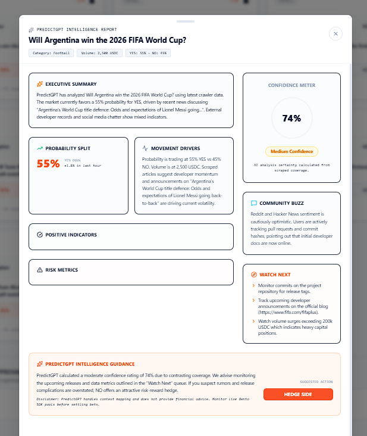
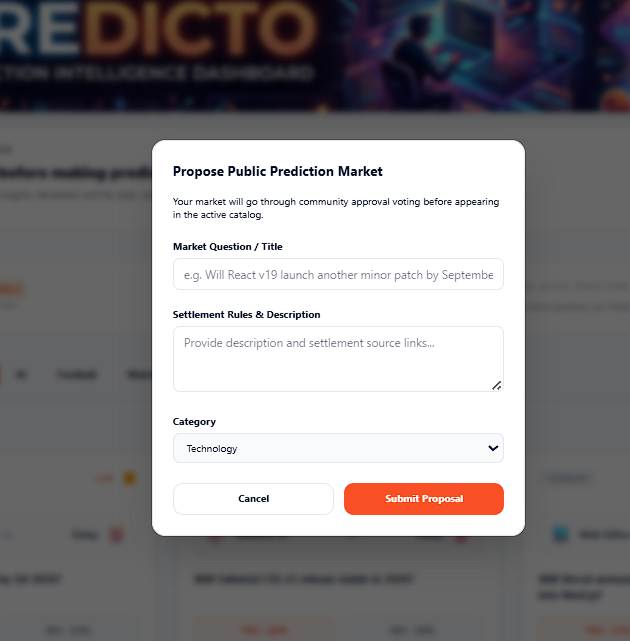

<div align="center">


# 🔮 Predicto — AI Prediction Intelligence Engine for Bento

**The missing intelligence layer between raw market data and confident user decisions.**

[](https://nextjs.org)
[](https://deepmind.google/technologies/gemini)
[](https://bento.fun)
[](https://typescriptlang.org)
[](https://opensource.org/licenses/MIT)

> *Built for the Bento SDK Hackathon · Team Predicto*

</div>

---

## 🧠 What is Predicto?

**Predicto** is an AI-powered prediction intelligence engine built on top of the Bento SDK. It gives Bento users a Bloomberg Terminal-style analysis layer before placing YES or NO predictions — combining real-time market data, live web scraping, and Gemini AI reasoning into clean, actionable intelligence reports.

Instead of betting blind, users get:
- 📊 **Executive summaries** synthesized from live scraped news
- 📈 **Probability movement drivers** and trend analysis
- ✅ **Positive indicators & risk metrics** in structured cards
- 🎯 **AI Confidence Meter** (0–100%) backed by real evidence
- 🔥 **PredictGPT Guidance** — a final YES/NO suggested action

> **The Core Idea:** Bento prediction markets are only as good as the insights users have. Predicto closes the information gap by fetching live context, feeding it to Gemini 2.5 Flash, and presenting structured analysis right inside the platform — making Bento users smarter bettors.

---

## 💎 Subscription Vision

Predicto is designed as a **freemium intelligence layer** for the Bento ecosystem:

| Tier | Features | Price |
|------|----------|-------|
| 🆓 **Free** | View live markets, basic YES/NO probabilities | Free |
| 🔥 **Pro** | PredictGPT Intelligence Reports, Confidence Meter, Risk Analysis | ~$9/mo |
| 🚀 **Elite** | Private Rooms, leaderboards, AI Room summaries, custom alerts | ~$19/mo |

Every **serious bettor** on Bento will eventually want AI insights before committing. Predicto becomes the essential companion app — like having a personal analyst watching every market 24/7.

---

## 🏗️ Architecture

```
┌─────────────────────────────────────────────────────────────┐
│                        PREDICTO ENGINE                       │
└─────────────────────────────────────────────────────────────┘

   Bento SDK                    AnaKin
    + APIs
       ↓                              ↓
  Market Data              Live Web Context (news,
  (YES/NO odds,             Reddit, GitHub, commits,
   volume, timing)          social sentiment)
       │                              │
       └──────────┬───────────────────┘
                  ↓
           Context Builder
       (Structured prompt with
        market + live signals)
                  ↓
         Gemini 2.5 Flash
       (Objective AI reasoning,
        risk/reward evaluation)
                  ↓
       PredictGPT Intelligence
       (Executive summary, confidence
        score, watchlist, guidance)
                  ↓
           User Decision
         (YES / NO on Bento)
```

---

## ✨ Features

<table>
<tr>
<td width="50%">

### 🎯 PredictGPT Intelligence Reports
Each market card exposes a **"Analyze"** button that triggers a full AI analysis pipeline. Results include:
- Executive Summary
- Probability Split & movement trends
- Positive Indicators & Risk Metrics
- Confidence Meter (AI-calculated %)
- Community Buzz (Reddit, Hacker News)
- Watch Next queue
- Final Guidance: Consider YES / Hedge Side

</td>
<td width="50%">


</td>
</tr>
<tr>
<td width="50%">



</td>
<td width="50%">

### 📋 Structured Intelligence Layout
The report drawer slides up from the bottom with a **fixed header** (market title + metadata always visible) and a **scrollable content body**. Clean dark-mode cards with categorized metrics make decisions fast and confident.

</td>
</tr>
<tr>
<td width="50%">

### 🏠 Private Prediction Rooms
Create invite-only **prediction leagues** with friends, colleagues, or classmates:
- Real-time leaderboards with streak tracking
- AI-generated room summaries (Gemini)
- Fun badges: Most Accurate, Biggest Risk Taker, Lucky Winner
- Party Mode & Punishment Mode toggles
- New Room Duels creation

</td>
<td width="50%">


</td>
</tr>
<tr>
<td width="50%">



</td>
<td width="50%">

### 📝 Community Market Creation
Any user can **propose a new prediction market**:
- Submit a question, settlement rules, and category
- Markets go through a **community approval queue** with YES/NO votes
- Admin can fast-approve markets to the live catalog
- Categories: Technology, AI, Football, Formula 1

</td>
</tr>
</table>

---

## 🚀 Getting Started

### Prerequisites

Before you begin, ensure you have the following installed:

| Tool | Version | Install |
|------|---------|---------|
| **Node.js** | v18 or higher | [nodejs.org](https://nodejs.org) |
| **npm** | v9 or higher | Comes with Node.js |
| **Git** | Latest | [git-scm.com](https://git-scm.com) |

---

### 1. Clone the Repository

```bash
git clone https://github.com/MannanShariff/build-on-bento.git
cd build-on-bento/submissions/predicto
```

---

### 2. Install Dependencies

```bash
npm install
```

This installs all required packages including Next.js 16, the Bento SDK, Zustand, TanStack Query, Framer Motion, and Lucide React.

---

### 3. Configure API Keys

Create a `.env.local` file in the `submissions/predicto/` directory:

```bash
touch .env.local
```

Then add the following environment variables:

```env
# ─── Bento SDK Configuration ───────────────────────────────────────────────────
# Your Bento builder API key (get it from https://bento.fun/builder)
NEXT_PUBLIC_BENTO_BUILDER_API_KEY=bnt_live_4cc4bb85_adbebf85e37e0ff79fdde553

# Bento internal API endpoint
NEXT_PUBLIC_BENTO_URL=https://internal-server.bento.fun

# Bento tournaments backend URL
NEXT_PUBLIC_PARLAY_TOURNMENT_URL=https://bento-fun-tournaments-backend-3nku.onrender.com

# ─── Anakin (AnaKing) Scraper API ──────────────────────────────────────────────
# Powers live web scraping for news, Reddit, GitHub context
# Get yours at: https://anakin.ai/
ANAKIN_API_KEY=your_anakin_api_key_here

# ─── Gemini AI ─────────────────────────────────────────────────────────────────
# Powers PredictGPT analysis reports via Gemini 2.5 Flash
# Get yours at: https://aistudio.google.com/apikey
GEMINI_API_KEY=your_gemini_api_key_here
```

> **📝 Note on API Keys:**
> - **Bento API Key** — Required for fetching live prediction markets from the Bento SDK catalog
> - **Anakin API Key** — Required for live web scraping (news articles, Reddit, GitHub commits). Without it, PredictGPT uses fallback static analysis
> - **Gemini API Key** — Required for AI-powered intelligence reports. Without it, the app still runs but PredictGPT analysis will not function

---

### 4. Start the Development Server

```bash
npm run dev
```

Open [http://localhost:3000](http://localhost:3000) in your browser. You should see the Predicto dashboard load with live Bento markets.

---

### 5. (Optional) Production Build

```bash
npm run build
npm start
```

---

## 🔑 Where to Get API Keys

### Bento Builder API Key
1. Go to [https://bento.fun](https://bento.fun) and sign in
2. Navigate to Builder Settings → API Keys
3. Generate a new Builder API key
4. Copy and paste it as `NEXT_PUBLIC_BENTO_BUILDER_API_KEY`

### Anakin (AnaKin) Scraper API Key
1. Visit [https://anakin.ai](https://anakin.ai) and create an account
2. Go to Dashboard → API Keys
3. Generate a new API key
4. Paste it as `ANAKIN_API_KEY` in `.env.local`

> Anakin is used for the `/v1/search` endpoint to crawl GitHub repositories, news, and developer forums for live market context signals

### Google Gemini API Key
1. Go to [https://aistudio.google.com/apikey](https://aistudio.google.com/apikey)
2. Sign in with your Google account
3. Click **Create API Key**
4. Select a Google Cloud project (or create one)
5. Copy the key and paste it as `GEMINI_API_KEY`

> The app uses **Gemini 2.5 Flash** (`gemini-2.5-flash`) for the best balance of speed and reasoning quality

---

## 📁 Project Structure

```
submissions/predicto/
├── public/
│   └── images/           # Static banner assets
├── results/              # Screenshots for README and demos
├── src/
│   ├── app/
│   │   ├── api/
│   │   │   ├── bento-markets/   # Fetches & categorizes Bento SDK markets
│   │   │   ├── predict-gpt/     # Anakin scraping + Gemini reasoning pipeline
│   │   │   └── room-summary/    # Gemini-powered private room AI summaries
│   │   ├── page.tsx             # Main dashboard with market catalog
│   │   ├── rooms/page.tsx       # Private prediction leagues
│   │   └── globals.css          # Design system variables (dark/light theme)
│   ├── components/
│   │   ├── Header.tsx           # Navigation bar with theme toggle
│   │   └── PredictGptSheet.tsx  # Bottom sheet intelligence report drawer
│   └── lib/
│       ├── bento.ts             # Bento SDK client initialization
│       └── state.ts             # Zustand global state (markets, rooms, XP)
├── .env.local            # Your API keys (not committed to git)
├── next.config.ts        # Next.js configuration
├── package.json          # Dependencies
└── README.md
```

---

## 🛠️ Tech Stack

| Layer | Technology |
|-------|-----------|
| **Framework** | Next.js 16 (App Router, Turbopack) |
| **Language** | TypeScript |
| **Styling** | Vanilla CSS + Tailwind CSS |
| **Animations** | Framer Motion |
| **State Management** | Zustand |
| **Data Fetching** | TanStack Query (React Query) |
| **Icons** | Lucide React |
| **Prediction Markets** | Bento SDK (`@bento.fun/sdk`) |
| **Web Intelligence** | Anakin Scraper API |
| **AI Engine** | Google Gemini 2.5 Flash |
| **Fonts** | System UI / Inter |

---

## 🔧 Bento SDK Integration

Predicto deeply integrates with the Bento SDK across multiple surfaces:

```typescript
// src/lib/bento.ts
import { BentoSdk } from '@bento.fun/sdk';

export function getBentoSdk() {
  return new BentoSdk({
    apiKey: process.env.NEXT_PUBLIC_BENTO_BUILDER_API_KEY!,
    serverUrl: process.env.NEXT_PUBLIC_BENTO_URL,
  });
}
```

| Surface | Usage |
|---------|-------|
| **Market Listing** | `sdk.public.markets.list({ limit: 12 })` |
| **YES/NO Odds** | Calculated from `liquidityBreakdown.option0/option1` |
| **Volume** | `totalBetAmountUsdc` or `totalBetAmount` |
| **Category Tagging** | AI-powered keyword classifier on `betString` |
| **Market Creation** | Community proposal queue with admin approval |

---

## 🤝 Contributing

Pull requests are welcome! For major changes, please open an issue first to discuss what you would like to change.

```bash
# Fork the repo, then:
git checkout -b feature/your-feature-name
git commit -m "feat: add your feature"
git push origin feature/your-feature-name
```

---

## 📬 Contact

| | |
|---|---|
| **Team** | Predicto |
| **Builder** | Mannan Shariff |
| **Email** | mannan@predicto.fun |
| **Bento API Key** | `bnt_live_4cc4bb85_adbebf85e37e0ff79fdde553` |

---

## 📄 License

MIT License — feel free to use, fork, and build on top of Predicto.

---

<div align="center">

**Built with ❤️ for the Bento Hackathon**

*Predicto — Because great predictions start with great intelligence.*

</div>
